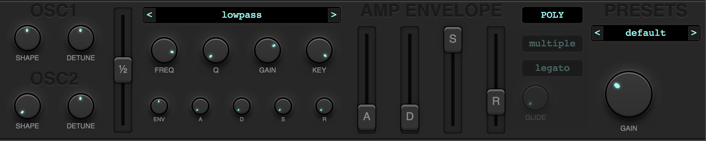

# Colossal 
Substractive synth using Webaudio API and React

## Demo
[DEMO](https://colossal.surge.sh)

## Screenshot

## How it works
Colossal can work in polysynth or monosynth modes.

Each voice has this structure:

